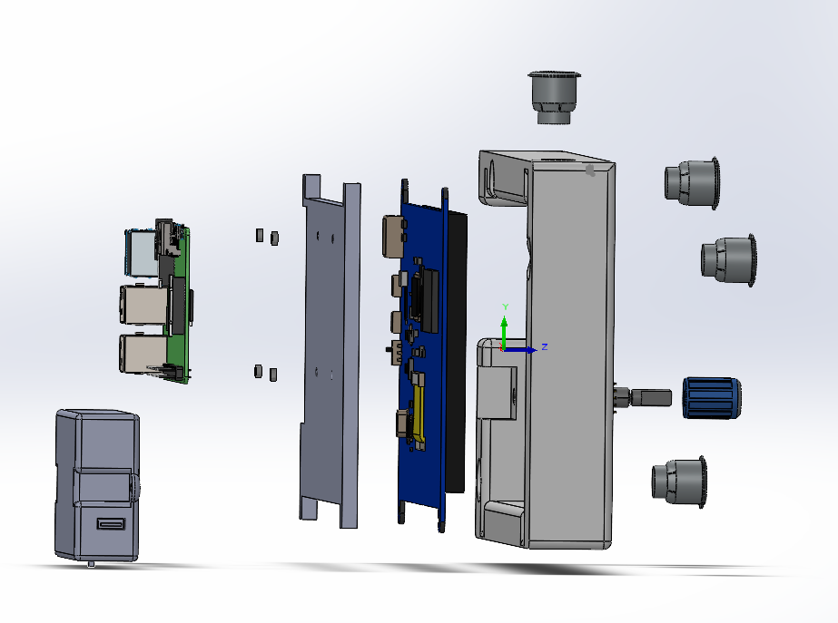
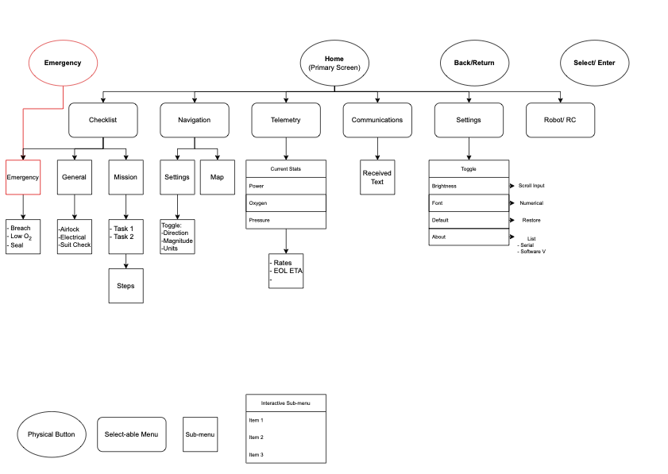

# Astronaut Wrist Interface (AWI)

## Project Overview

Currently, astronauts use antiquated and inefficient methods to display typical EVA procedures, emergency protocols, and various pieces of information such as critical EMU suit metrics.  This would allow astronauts to easily access and interact with these protocols and metrics, as well as provide additional functionality for EVA missions and location services. 

This information could consist of important information such as suit diagnostics, consumption rates, location monitoring, emergency checklists, and potential vehicle drone control. There are multiple ways that this system could be interacted with and expanded upon once implemented. 

The AWI will use an electronic screen that shall display relevant information to the astronaut. The display will show the astronaut the necessary checklists, location data, pictures, and videos that they will need for a given mission, and should be controllable even during an EVA. Additional features such as navigation will also require a number of sensors to collect the data required to show up on the visual interface. A navigational connection with the “home base” is the main priority.

Design considerations must be made for the unique conditions of the planned area this device will be used, including radiation, thermal, and vacuum related variables that don’t normally come up during typical projects. The AWI must also conform to all NASA safety requirements, most relevant regulations can be located in the Human Integration Design Handbook (NASA-STD-3001.)

---
# Prototype Build
During the semesters starting from spring 2022 and fall 2022. The AWI team has been working on a prototype that is supposed to emulate the functions of the flight unit version of the AWI project. Below are some of the materials that were utilized in the building of the prototype. These materials are all commercial available components which are relatively inexpensive. 

## Materials
These are some of the main components I utilized to develop the first prototype (*Mark I*)
- Raspberry Pi 4 (RP4)
- Arduino Nano
- Kuman 7 in touchscreen display
- HiLetgo 433 MHz transmitter and receiver  
- DS18B20 Temperature sensor module
- Adafruit 9-DOF IMU Fusion-Breakout BNO055
- PiSugar Plus 2 Battery Pack
- 7 Push buttons


## Material Overview
- **Raspberry Pi 4:** We decided to go with the Raspberry Pi 4 due to the wealth of available projects and information on the internet. This mean that if we ran into a problem, it was pretty much certain that someone else at some point had run into the same problem before. With the vision of making the AWI a platform, not just a checklist replacement, we needed a microcontroller capable of withstanding the possible implementations of the AWI. 
- **Arduino Nano:** The Arduino Nano board is nothing else but what simulates the "Base" on a celestial body like the Moon or Mars. Its whole purpose is to emit a small RF signal used to demonstrate part of the navigation system. 
- **Kuman Display:** This is nothing more than a cheap display made for the RP4. The original plan was to lead with a flexible OLED display, unfortunately, those are were not available to us as companies we reached out did not answer back to our request to purchase one. 
- **HiLetgo 433 MHz transmitter and receiver:** This is pretty self-explanatory. Simple RF receiver and transmitter  
- **BNO055:** This is Adafruit accelerometer and gyroscope. It is the main sensor that is implemented in the inertial navigation system. 
- **PiSugar Plus 2 Battery Pack:** As the name implies, this is a battery pack for the RP4. The great thing about this specific battery pack is that it has its own integrated board that is connected to a website. In this website, we can modulate the power sent to the RP4 board and even include power modes. 
- **The rest:** The rest include wires, simple push buttons, 3D prints, breadboards, empty PCBs 


As of right now, the physical integration of the components is still in development. The image below displays a potential arrangement of some of the components. 



## AWI Physical Assembly Guide 
Given the current state of the development of AWI this specific section is still pending. The only physical assembly instructions available at the moment is the connection of the screen to the RP4 via the HDMI connection port, as well as a connection of the screen and Pi to a power source. As the coming weeks pass and the physical development of the Pi evolves, there will be a more detailed guide on how our version of the AWI can be assembled together.

---
# Programming

## File Overview
Currently there is one main folder called checklists. In this specific folder, there are subfolders that correspond to specific types of checklists. The path to these checklists is important. If you change the file structure, when you run the code there will be issues finding the checklists unless you update the path inside the code. 

There will be another folder called "venv". This file corresponds to the virtual environment in which the code should run when you run the code in your computer. There is a section below just about the virtual environment, which explains in detail how it works and why it is needed. 

Aside from the folders previously mentioned, there are also some important files:
- **MainInterface.py:** This file is the main file that you run in order to boot up the AWI. This file interacts with other files and the folders needed. The main structure of the GUI is delineated in this file. This file receives the inputs from the subsystems and is in charge of displaying them.
- **requirements.txt:** This file is a simple text file that has the libraries and install requirements needed in order to run the AWI code. This file interacts with the virtual environment.
- **.gitignore:** This file is very important. This file in essence tells GitHub which files or folders to not push into the repo. The specific folder and set of files that we are not interested in pushing to GitHub are the virtual environment related files. This means the "venv" folder. This is because each computer system has a different way of setting up the virtual environment, and using the one pushed to the code will most likely not run.

In the next weeks, more files will appear. These files are:
- **telemetry.py:** This specific file is the program that will determine the values that are displayed by the telemetry dashboard. Some of the values will be pressure, power, or temperature. More over, this specific file will also be in charge of raising any telemetry based alerts. 
- **navigation.py:** This file, as the name states, is for the navigation. This file will communicate with the navigation sensors, like the RF receiver and the inertial sensor. It will calculate a vector determining the direction of the "base", and return this vector to the home window code and the navigation window.

Eventually there will be files for each of the functionalities that the AWI system provides, like communications or video.

Below is a diagram that outlines the overall file interaction and structure. The AWI system is modeled similarly as most modern sites and applications. That means having a "front end"
and a "back end". Where the "front end" deals with what the user sees, the design of the site, and the flow of the menus, while the "back end" is the engines on the back that are producing the data that is displayed by the "front end". 

![[File Explanation.svg]]


## Coding Resources
These are some links that can help with the development.
- [You can download latest version of pyqt5](https://pypi.org/project/PyQt5/) 
- [pyqt5 documentation](https://www.riverbankcomputing.com/static/Docs/PyQt5/) 
- [Raspberry Pi GPIO python documentation](https://pythonhosted.org/RPIO/) 
- [GitHub commands](https://education.github.com/git-cheat-sheet-education.pdf)
- [Virtual Environment Windows](https://code.visualstudio.com/docs/python/environments)
- [Accelerometer Documentation](https://docs.circuitpython.org/projects/bno055/en/latest/)
- [Accelerometer Python Tutorial](https://learn.adafruit.com/adafruit-bno055-absolute-orientation-sensor/python-circuitpython)
- [PyQT Plotting Library](https://www.pythonguis.com/tutorials/plotting-pyqtgraph/)

---
## Virtual Environment
What is a virtual environment? A virtual environment is a virtual space within your project folder where you run the code you are looking to run. This is very important in the case of AWI if you have several team members coding. You can set the specific library and code versions that are installed and can be run on the virtual environment. This ensures that whenever the computer you are programming in updates and the python version changes, the code for AWI still runs as expected. This also accounts for different team members having different versions of Python, which means that the code would not run on their system. This way, everyone that wants to run the AWI code on their computer, will be able to and without problems. 


### **Instructions for macOS**
In order to run the code efficiently, and avoid version issues, you will need to set up a virtual environment. As of right now, the environment should work with python version 3.9.12 and pyqt5 5.15.7

Make a folder called ```venv```

Then run the following command on your IDE terminal/console

```
$ python3 -m venv venv
```

When you want to run the code, you will need to activate the environment by typing the following command:

```
$ source venv/bin/activate
```

This will let you enter your environment, and you can then install the right python version and the right pyqt5 version

```
pip3 install python
```

```
pip3 install pyqt5
```


### **Instructions for Windows**
We used Visual Studio Code as our IDE to do this project. This is how to install the virtual environment to run the code.

Once you are in VS Code, write the following command in the terminal. 
```
$ python -m venv .venv
```

Then write the following command to get to the correct folder
```
$ cd .\venv\venv\bin\
```
Then write the following command to activate the virtual environment.
```
$ ./activate
```

---

## GUI Architecture
The outline below describes the overall architecture of the AWI GUI. The diagram details how some buttons are connected with the submenus and the path of each submenu. An important addition to this diagram will be the interaction of alert systems and their impact on the view that is present in the screen. These specific alerts would mainly stem from the telemetry code. 



---
## Raspberry Pi and AWI running instructions
In order to get the AWI application that is on the GitHub to run, there are several steps that are needed to be done on the Raspberry Pi first. 

Before you can set up the software of the Raspberry Pi, you need to hook up the Pi to a power source, a visual source (monitor), and ideally a mouse and keyboard. Once that is done, you can set up the software with the following steps.

1. Set up the RP4 operating system. When Raspberry Pis first arrive, they do not currently run any visual operating systems. For our purposes, we installed "Raspbian OS" on an SD card, which is what hold the data of the Pi.  [This](https://www.raspberrypi.com/software/) is a link that has a guide about the Raspbian OS and how to get it on the Raspberry Pi. 
2. Get an IDE that can edit and run python scripts on the Pi itself. This is important whenever you get to the button testing and sensor implementation. 
3. Get the codebase from the GitHub repo on a flash drive and connect it directly to the Pi. You can transfer the whole project folder on to the Pi.
4. Inside the console/terminal of the Pi, make sure to install the appropriate versions of the Python and the PyQT5 libraries, as well as any other GPIO (General Pins Input Output) or sensor libraries needed for the code to run properly. Specific instructions on how to install those libraries and versions will be added in the next iteration of this document. 
5. Connect all the sensors and buttons per the **AWI Physical Assembly Guide** above.
6. Run MainInterface.py script on the terminal utilizing the command:  ``` python3 MainInterface.py ```


Once you have familiarized yourself with the AWI system and how the current iteration operates, feel free to grow it and make it your own! 

---
## Trouble shooting

Screen display issues
1. If the Pi is not showing any ouput to the screen, this could be due the HDMI input plugged into prior to the Pi being turned on. Make sure the HDMI input is plugged in first before turning on the Pi.
2. If the screen is still not turning on, check the backside of the screen board to see if the ON switch is flipped on.

Wifi Issues
1. The raspberry pi has a wifi adapter plugged into it, this should cover all the wireless needs. It is an older adapter (2014) so if the internet stops working be sure to check if it is functioning or get a new unit. 

Power Issues
1. Make sure that the battery is fully charged before using the AWI.
2. If the AWI is not turning on through the battery, use a USB-C cable to power it instead.
3. The screen can be powered either from the raspberry pi or any USB-A input.

Coding Issues
1. If you code from your personal computer to import new code for the AWI, make sure that you are coding with Python version 3.9.12 to ensure optimal compatibilty.
2. If PyQt5 is not working, do the following.
3. Check to see if the PyQt5 widgets are spelled correctly in the code.
4. Check if they are compatibilty issues with other loaded in modules.
5. Try creating functions to seperate the code so the problem can be isolated.
6. If this doesnt work, create a virtual environment and download Python and PyQt5 on there instead.
7. Be sure to use the command 'git pull' to update the code if you are working through GitHub. 
8. If a module is going to be installed, update pip.

Button Issues
1. Make sure each button wire has one wire connected to the correct GPIO pins (reference a Pi GPIO chart) and one wire connected to a ground pin as well.
